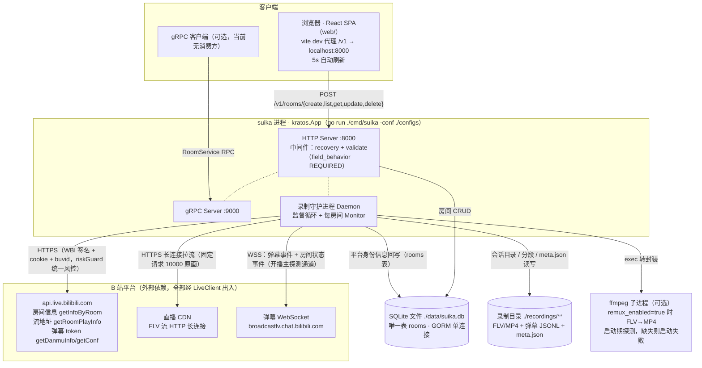
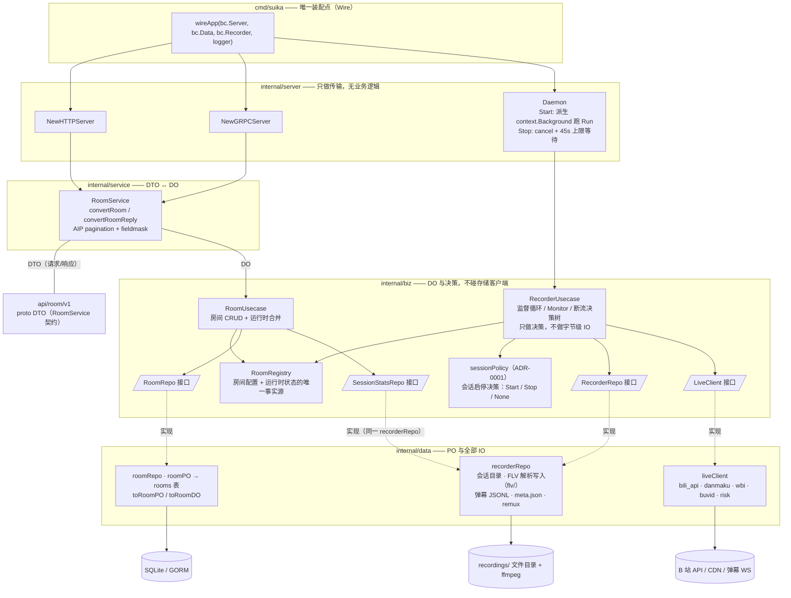
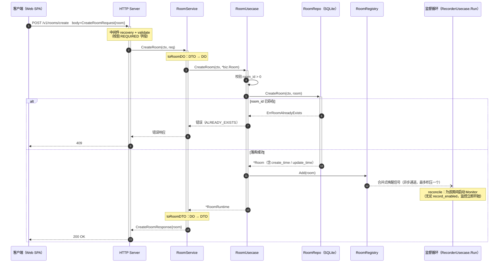
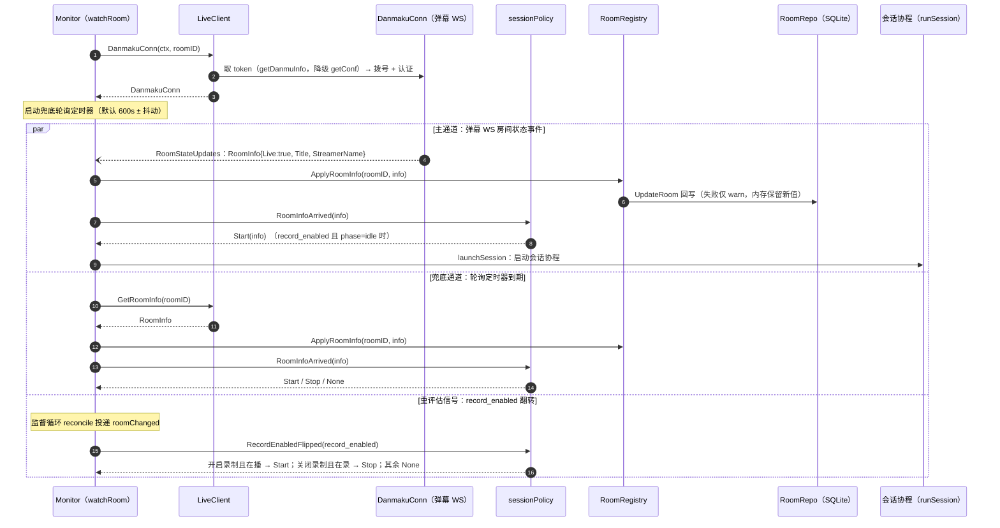
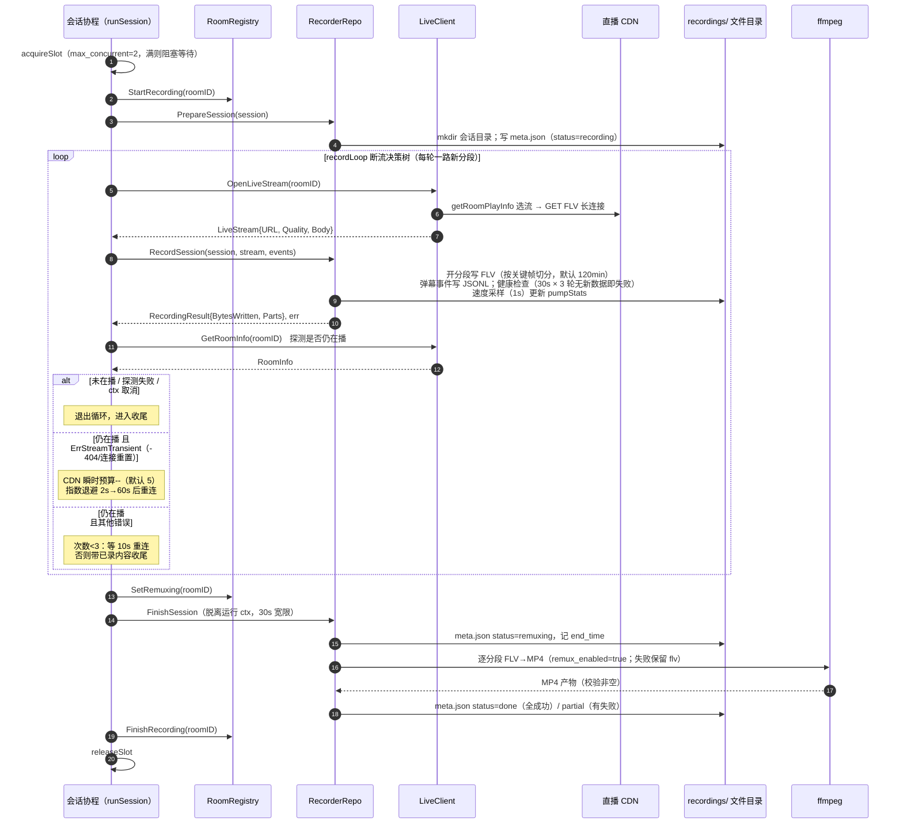
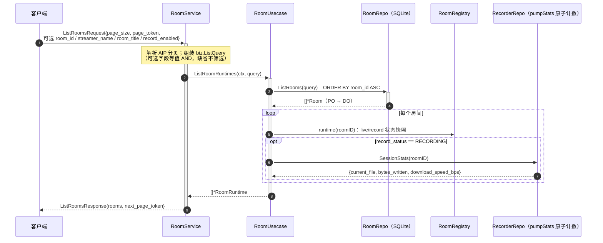
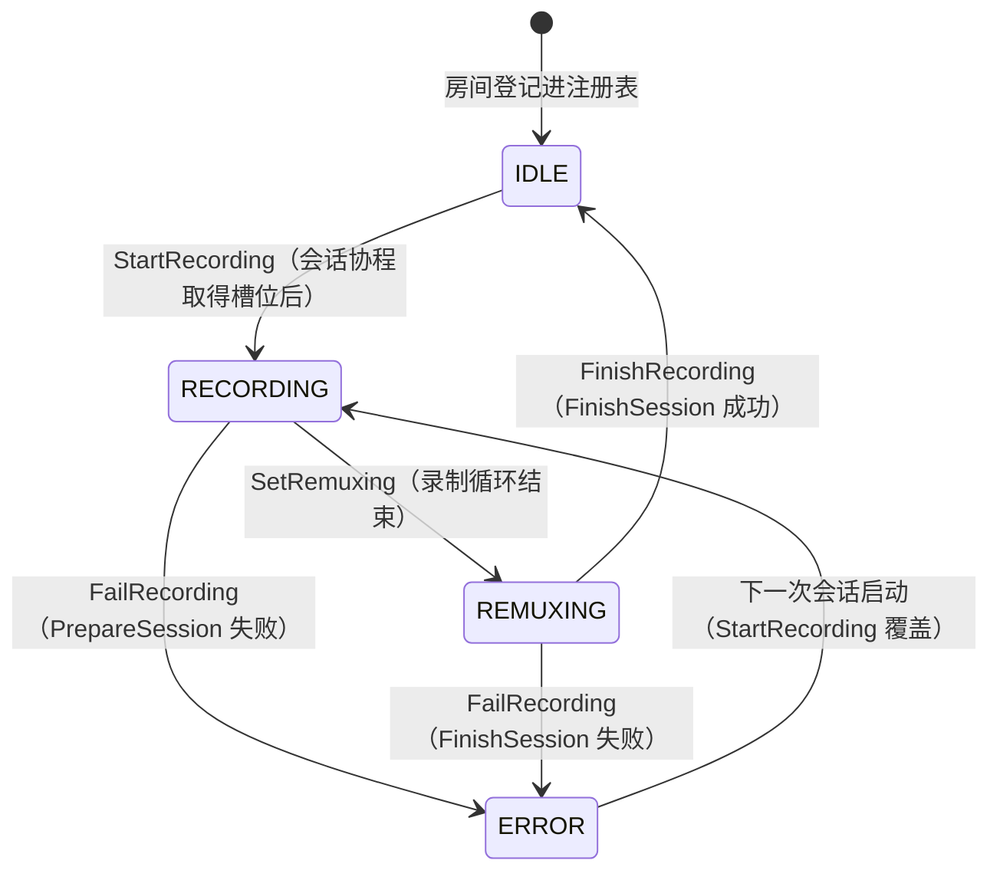
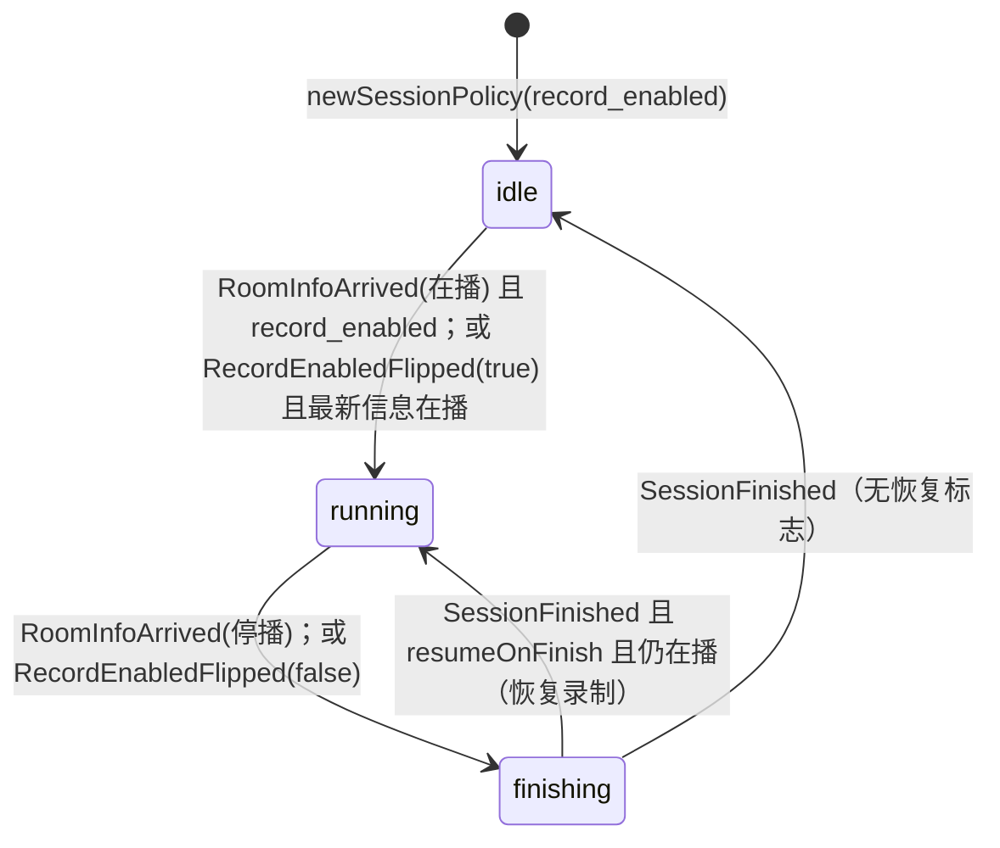
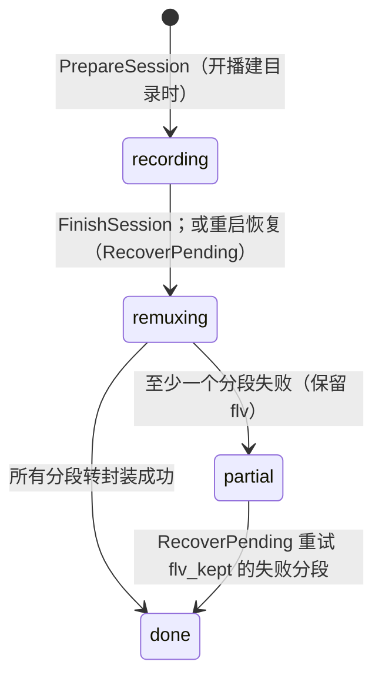
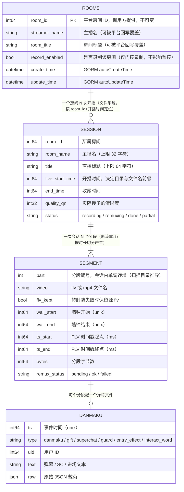

# Suika 架构图集

基于当前代码（2026-08 快照）绘制。Suika 是一个 Kratos（go-kratos/v3）单体服务，负责 B 站直播间管理与直播录制。术语遵循仓库根目录 `CONTEXT.md`（Monitor = 每房间监控协程；Reconcile 仅指监督循环的监控集合调和；会话启停决策属于 sessionPolicy）。

| 分类 | 图表 | 核心作用 / 解决什么问题 |
|---|---|---|
| 宏观架构 | [系统/部署架构图](#1-系统部署架构图) | 划分服务边界：单进程、SQLite、录制文件目录、外部 B 站平台如何连接 |
| 代码分层 | [应用架构图](#2-应用架构图) | 规定 server / service / biz / data 的调用层级与依赖方向 |
| 动态交互 | [时序图](#3-时序图) | 梳理房间 CRUD、开播检测、录制会话的调用链，明确同步/异步与入参出参 |
| 状态流转 | [状态机图](#4-状态机图) | Room 录制状态、会话策略阶段、meta.json 会话状态的变化与触发事件 |
| 数据建模 | [ER 图](#5-er-图) | rooms 表结构与录制会话（meta.json 逻辑实体）的一对多关系 |

配套深读：`docs/design/bili-recorder.md`（录制器细节）、`docs/adr/0001-session-policy-module.md`（会话策略模块决策）。

---

## 1. 系统/部署架构图

**解决的问题**：服务边界在哪、依赖什么基础设施。

Suika 是**单进程、单机部署**：一个 `kratos.App` 内并行运行三个 `transport.Server` —— HTTP（:8000）、gRPC（:9000）与录制守护进程（`server.Daemon`）。没有 API 网关、没有消息队列，也不依赖其他基础设施。



要点：

- **唯一的图化消费方是 Web SPA**；HTTP 与 gRPC 暴露同一份 `api/room/v1/room.proto` 契约。
- 所有 B 站流量收敛在 `LiveClient` 一个缝（`data/bili_api.go`、`danmaku.go`、`wbi.go`、`buvid.go`，风控编排集中在 `risk.go` 的 `riskGuard`：冷却门、412/403/429 与 -352 刷新重试、旧接口降级）。
- 录制产物是**文件系统**而非数据库；`meta.json` 是录制历史的唯一事实源，重启后由 `RecoverPending` 扫描恢复。

---

## 2. 应用架构图

**解决的问题**：进程内部的分层与依赖方向。对应通用三层概念：service ≈ Controller 边界（DTO↔DO），biz ≈ Service（领域决策），data ≈ DAO（PO 与 IO）。

三种模型形状跨层流转：**DTO**（`api/room/v1` proto 请求/响应）→ **DO**（`biz` 纯领域对象）→ **PO**（`data` 存储形状 `roomPO`）。



分层纪律（违反箭头方向即分层错误）：

| 层 | 拥有 | 边界语言 | 禁止 |
|---|---|---|---|
| service | — | DTO ↔ DO | PO、存储客户端、业务规则 |
| biz | DO、用例、仓储接口 | DO | DTO、PO、存储客户端 |
| data | PO、`toXxxPO/toXxxDO` | DO ↔ PO | DTO |
| server | 传输装配 | — | 转换与业务逻辑 |

两条关键倒置缝都在 `biz` 声明、`data` 实现：`LiveClient`（平台 IO）与 `RecorderRepo`（磁盘 IO）；`RoomRepo` 同理。`RoomRegistry` 是被两侧共享的运行时状态中枢：房间 CRUD 落库后同步 `Add/Update/Remove`，录制守护进程经 `Subscribe` 的合并式信号实时调和监控集合，无需重启。

---

## 3. 时序图

四张时序图覆盖全部调用链：① 房间创建（同步 CRUD 全链）、② 开播检测与会话启动（异步事件驱动）、③ 录制会话与断流决策树、④ 房间查询（运行时状态合并）。

### 3.1 房间创建：CreateRoom 同步链

入参 `CreateRoomRequest{room}`，出参 `CreateRoomResponse{room}`；重复 `room_id` 返回 `ERROR_REASON_ALREADY_EXISTS`（HTTP 409）。



同构变体：

- **UpdateRoom**：service 先 `GetRoom` 读当前值 → `fieldmask.Update` 合并（仅允许 `streamer_name` / `room_title` / `record_enabled` 路径）→ 落库 → `registry.Update`。`record_enabled` 翻转经监督循环以重评估信号送达 Monitor，实时启停录制。
- **DeleteRoom**：落库 → `registry.Remove` → reconcile 立即取消该房间 Monitor（活跃会话优雅停止，已录文件保留），返回 `DeleteRoomResponse{empty}`。

### 3.2 开播检测与会话启动（异步事件驱动）

Monitor（`watchRoom`）的 select 分支只投递输入，启停裁决全部来自 `sessionPolicy`：Start(info) / Stop / None。



### 3.3 录制会话：拉流、断流决策树、收尾

会话协程独占完整生命周期：槽位 → 准备 → 录制循环 → 收尾/转封装。录制状态写入 `RoomRegistry`（RECORDING → REMUXING → IDLE/ERROR，见 §4.1）。



### 3.4 房间查询：运行时状态合并（同步读链）

`GetRoom` 与 `ListRooms` 共用 `withRuntime` 合并：SQLite 持久化字段 + `RoomRegistry` 运行时快照 + （录制中时）`SessionStatsRepo` 写入进度。



（`GetRoom` 同链，仅以 `room_id` 单查；`page_size` 缺省 20。）

---

## 4. 状态机图

### 4.1 Room 录制状态 RecordStatus（核心实体状态）

状态由 `RoomRegistry` 持有，经房间 API 读取（`GetRoom`/`ListRooms` 的 OUTPUT_ONLY 字段 `record_status`）。`NoteError` 只记 `last_error`，**不**改变录制状态。



伴生的直播状态 `LiveStatus`：`UNSPECIFIED → PREPARING / LIVE`，由 `ApplyRoomInfo` 依据平台 `RoomInfo.Live` 双向切换。

### 4.2 会话策略阶段 sessionPolicy.phase（ADR-0001）

每个 Monitor 独享一个策略实例；阶段 + `record_enabled` 门控 + 最新房间信息共同裁决。"收尾中重新开启录制"由 `resumeOnFinish` 标志承接。



### 4.3 录制会话状态（meta.json 的 `status` 字段）

会话级事实源是磁盘上的 `meta.json`；进程崩溃/重启后由 `RecoverPending` 扫描 `recordings/*/*/*.meta.json` 续做。



分段级 `remux_status`：`pending → ok / failed`（失败且 `flv_kept=true` 才可在下次启动时重试）。

---

## 5. ER 图

数据库中**只有一张表 `rooms`**（GORM AutoMigrate，SQLite 单连接）。录制会话与分段不落库，而是以 `meta.json` + 媒体文件持久化在录制目录，图中作为逻辑实体给出，关系均为一对多：

```
recordings/<room_id>_<主播名>/<开播日期>/<日期_时间_标题>.meta.json
                                            .<日期_时间_标题>_partN.flv|.mp4
                                            .<日期_时间_标题>_partN.danmu.jsonl
```



说明：

- `SESSION` / `SEGMENT` / `DANMAKU` 三个实体对应 `meta.json` 的 `sessionMeta` / `segmentMeta` 结构与弹幕 JSONL 行（`danmuLine`），由 `data` 层独占读写，**没有外键约束**——关联键是目录路径与文件名约定，而非数据库引用。
- `rooms` 表的 `streamer_name` / `room_title` 会被录制守护进程经 `RoomRegistry.ApplyRoomInfo` 用平台非空值覆盖回写；回写失败只记 warn，不影响内存快照。
- 运行时的写入进度（`current_file` / `bytes_written` / `download_speed_bps`）不在任何持久层，来自 `recorderRepo` 内存中的 `pumpStats` 原子计数，仅在 `record_status=RECORDING` 时 best-effort 提供给查询。
