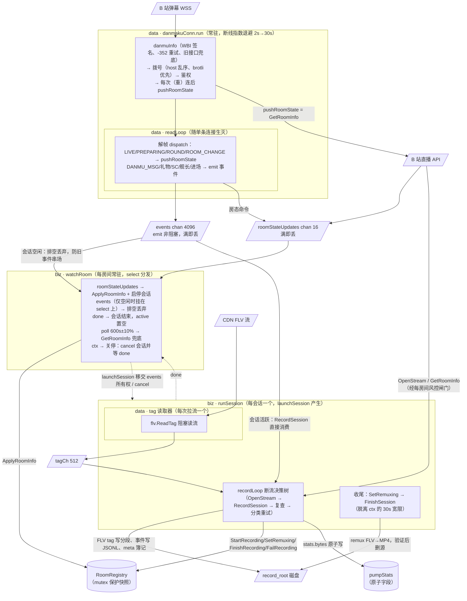
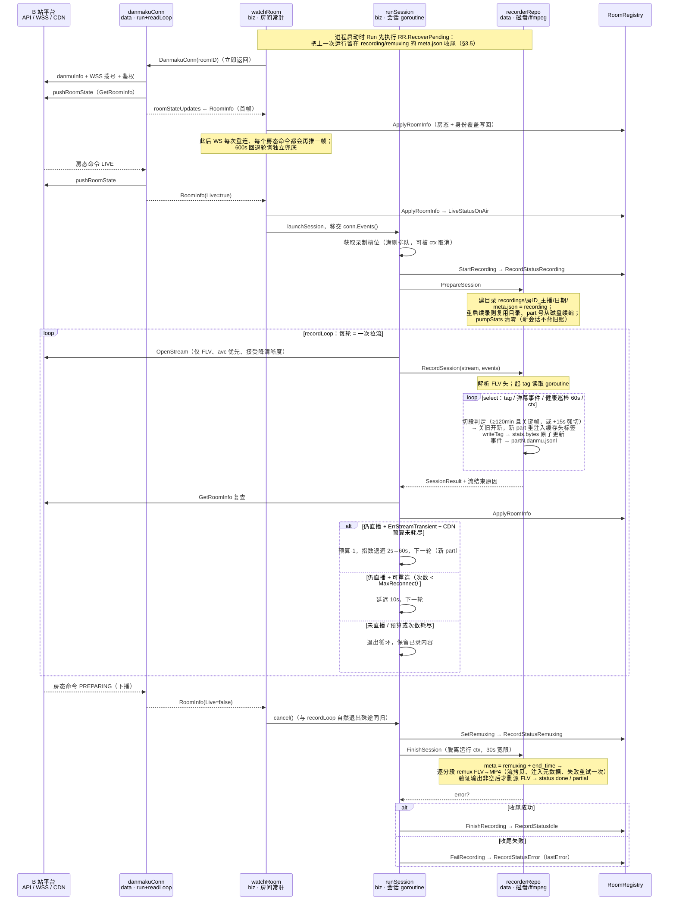
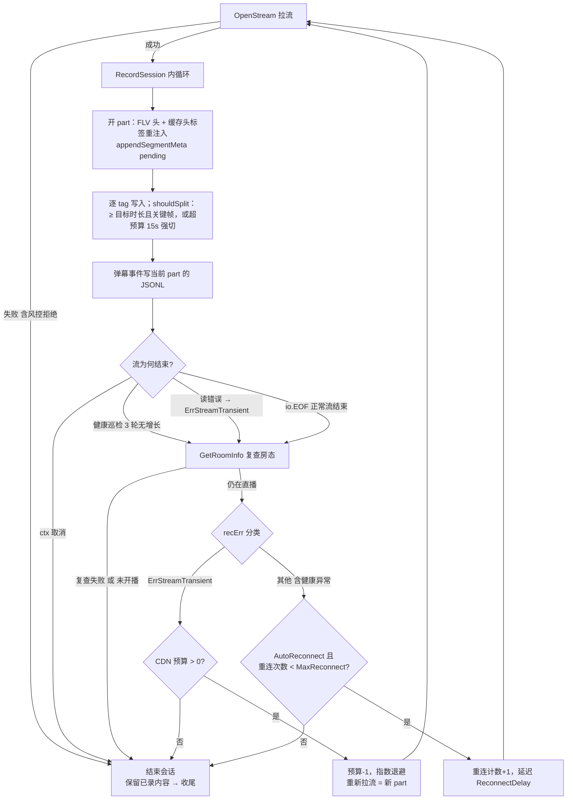
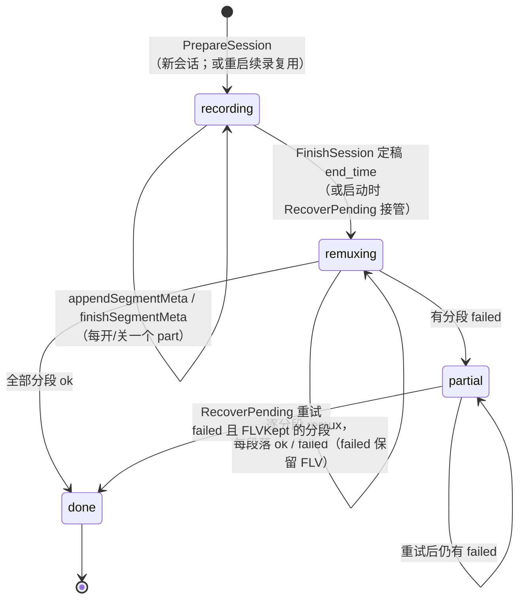
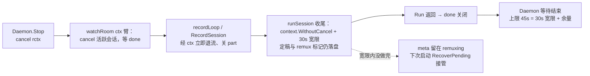
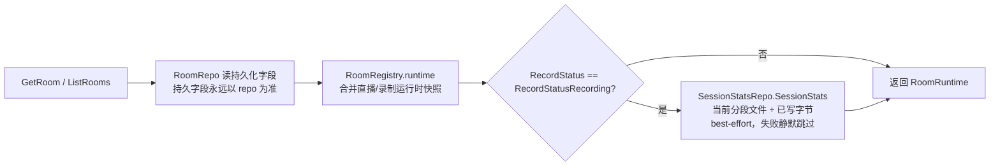
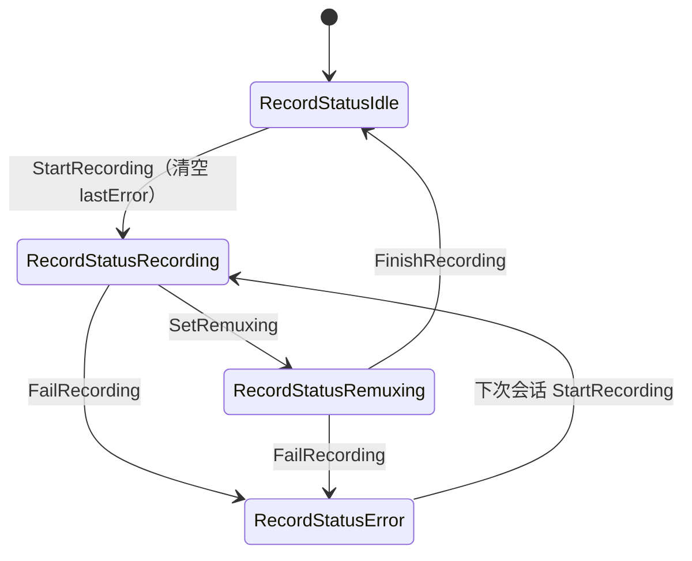

# Suika DDD 领域模型设计

本文抽离自录播技术文档（`docs/design/bili-recorder.md`），专注描述
suika 当前实现的 DDD 领域建模：§2 是静态模型（类型签名与
`internal/biz/` 逐字对应），§3 是运行时流程（goroutine、通道、磁盘
契约与关停语义），§4 解释这些形状背后的决策。仓库级分层契约见根目录
CLAUDE.md。

## 1. 子域划分

当前实现可抽象为两个协作子域：

| 子域 | 职责 | 消费者 |
|---|---|---|
| 房间管理（Room Management） | 可录制房间的持久化配置与查询视图 | Room CRUD API（HTTP/gRPC）、web/ 管理界面 |
| 录制执行（Recording Execution） | 开播感知、录制场次编排、断流重连与收尾 | 常驻录制守护进程（server.Daemon） |

两个子域不直接依赖对方的内部对象，协作只经过两条缝：

- `RoomRegistry` —— 共享的运行时状态容器。录制执行子域写入直播/录制
  状态，房间管理子域读取快照。
- `SessionStatsRepo` —— 面向房间查询的窄统计接口。房间读路径用它
  尽力而为地补充"当前文件/已写字节"，不依赖完整录制仓储。

## 2. 完整领域模型图

一张图覆盖两个子域的全部领域对象、用例、仓储/ACL 缝及其关系。
`<<...>>` 为构造型标注；`note` 承载错误与语义约定。

```mermaid
classDiagram
direction LR

namespace RoomManagement {
  class Room {
    <<DO>>
    +int64 RoomID
    +string StreamerName
    +string RoomTitle
    +bool Enabled
    +time.Time CreateTime
    +time.Time UpdateTime
  }

  class RoomRuntime {
    <<read model>>
    +Room Room
    +LiveStatus LiveStatus
    +RecordStatus RecordStatus
    +string CurrentFile
    +int64 BytesWritten
    +time.Time SessionStartedAt
    +string LastError
  }

  class LiveStatus {
    <<enumeration>>
    LiveStatusUnknown
    LiveStatusPreparing
    LiveStatusOnAir
  }

  class RecordStatus {
    <<enumeration>>
    RecordStatusIdle
    RecordStatusRecording
    RecordStatusRemuxing
    RecordStatusError
  }

  class ListQuery {
    <<query shape>>
    +*int64 RoomID
    +*string StreamerName
    +*string RoomTitle
    +*bool Enabled
    +int Offset
    +int Limit
  }

  class RoomUsecase {
    -repo RoomRepo
    -reg *RoomRegistry
    -stats SessionStatsRepo
    +GetRoom(ctx, roomID) (*RoomRuntime, error)
    +ListRoomRuntimes(ctx, query) ([]*RoomRuntime, error)
    +CreateRoom(ctx, room) (*RoomRuntime, error)
    +UpdateRoom(ctx, room) (*RoomRuntime, error)
    +DeleteRoom(ctx, roomID) error
  }

  class RoomRegistry {
    <<runtime state holder>>
    -repo RoomRepo
    -mu sync.Mutex
    -states map[int64]*roomState
    +Rooms() []Room
    +Room(roomID) Room
    -runtime(roomID) *RoomRuntime
    +ApplyRoomInfo(ctx, roomID, info)
    +StartRecording(roomID)
    +SetRemuxing(roomID)
    +FailRecording(roomID, err)
    +FinishRecording(roomID)
    +NoteError(roomID, err)
  }

  class roomState {
    <<internal>>
    +Room room
    +LiveStatus liveStatus
    +RecordStatus recordStatus
    +time.Time sessionStartedAt
    +string lastError
  }

  class RoomRepo {
    <<repository interface>>
    +GetByRoomID(ctx, roomID) (*Room, error)
    +ListRooms(ctx, query) ([]*Room, error)
    +CreateRoom(ctx, room) (*Room, error)
    +UpdateRoom(ctx, room) (*Room, error)
    +DeleteRoom(ctx, roomID) error
  }

  class SessionStatsRepo {
    <<repository interface>>
    +SessionStats(ctx, roomID) (*SessionStats, error)
  }
}

namespace RecordingExecution {
  class RecorderUsecase {
    <<usecase>>
    -registry *RoomRegistry
    -repo RecorderRepo
    -liveClient LiveClient
    -rec ReconnectPolicy
    -pollInterval time.Duration
    -maxConcurrent int
    -slots chan struct{}
    +Run(ctx) error
    -monitorRoom(ctx, roomID)
    -watchRoom(ctx, roomID) error
    -launchSession(ctx, roomID, info, events)
    -runSession(ctx, roomID, info, events)
    -recordLoop(ctx, roomID, session, events)
  }

  class Session {
    <<DO>>
    +int64 RoomID
    +string RoomName
    +string Title
    +time.Time LiveStartTime
    +StreamQuality Quality
  }

  class RoomInfo {
    <<platform event>>
    +int64 RoomID
    +bool Live
    +string Title
    +string StreamerName
    +time.Time LiveStartTime
  }

  class StreamQuality {
    <<value object>>
    +int32 Qn
    +string Desc
  }

  class StreamHandle {
    <<opaque handle>>
    +string URL
    +StreamQuality Quality
    +io.ReadCloser Body
  }

  class DanmakuEvent {
    <<value object>>
    +time.Time Ts
    +string Type
    +int64 UID
    +string Uname
    +string Text
    +int32 Color
    +int32 Mode
    +string GiftName
    +int32 Num
    +int64 Price
    +string CoinType
    +int32 Duration
    +int32 Level
    +[]byte Raw
  }

  class SessionResult {
    <<value object>>
    +int64 BytesWritten
    +int Parts
  }

  class SessionStats {
    <<value object>>
    +string CurrentFile
    +int64 BytesWritten
  }

  class ReconnectPolicy {
    <<policy>>
    +bool AutoReconnect
    +int MaxReconnect
    +time.Duration ReconnectDelay
    +int CDNTransientBudget
  }

  class RecorderRepo {
    <<repository interface>>
    +PrepareSession(ctx, session) error
    +RecordSession(ctx, session, stream, events) (*SessionResult, error)
    +FinishSession(ctx, session) error
    +RecoverPending(ctx) error
  }

  class LiveClient {
    <<acl interface>>
    +GetRoomInfo(ctx, roomID) (*RoomInfo, error)
    +OpenStream(ctx, roomID) (*StreamHandle, error)
    +DanmakuConn(ctx, roomID) (DanmakuConn, error)
  }

  class DanmakuConn {
    <<acl interface>>
    +Events() <-chan *DanmakuEvent
    +RoomStateUpdates() <-chan *RoomInfo
    +Close() error
  }
}

RoomRuntime *-- Room : composed from
RoomRuntime ..> LiveStatus
RoomRuntime ..> RecordStatus
RoomRegistry o-- roomState : one per room
roomState *-- Room : in-memory snapshot
RoomUsecase ..> RoomRepo : persist CRUD
RoomUsecase ..> RoomRegistry : read runtime snapshot
RoomUsecase ..> SessionStatsRepo : enrich write progress
RoomUsecase ..> ListQuery : query shape
RoomRegistry ..> RoomRepo : load rooms on init + persist identity
RoomRegistry ..> RoomInfo : ApplyRoomInfo

RecorderUsecase ..> RoomRegistry : drive state transitions
RecorderUsecase ..> Room : build Session from registry
RecorderUsecase ..> RecorderRepo : storage IO
RecorderUsecase ..> LiveClient : platform IO
RecorderUsecase ..> DanmakuConn : monitor per room
RecorderUsecase ..> ReconnectPolicy : drop decision tree
RecorderUsecase ..> Session : create / finish
RecorderUsecase ..> RoomInfo : live detection
RecorderRepo ..> Session : session layout
RecorderRepo ..> StreamHandle : consumes stream
RecorderRepo ..> DanmakuEvent : consumes events
RecorderRepo ..> SessionResult : reports
LiveClient ..> RoomInfo
LiveClient ..> StreamHandle
LiveClient ..> DanmakuConn : produces per room
DanmakuConn ..> DanmakuEvent : Events channel
DanmakuConn ..> RoomInfo : RoomStateUpdates channel
Session *-- StreamQuality
StreamHandle *-- StreamQuality
SessionStatsRepo ..> SessionStats

note for RoomUsecase "类型化错误：ErrRoomNotFound / ErrRoomInvalidArgument / ErrRoomAlreadyExists"
note for RecorderUsecase "只做编排决策，不做字节级 IO；哨兵错误 ErrStreamTransient / ErrRiskControl 供断流决策树分类"
note for StreamHandle "不透明句柄：由 LiveClient 产生、被 RecorderRepo 消费，biz 从不检视（同 *sql.Rows 用法）"
note for DanmakuConn "实现内部自行重连；每次重连后重新探测房态，补上断连期间错过的开播事件；Events / RoomStateUpdates 均为只读通道，Events 有界缓冲，无人消费时丢弃"
```

> 渲染提示：图使用 mermaid `namespace` 分组（mermaid ≥ 10.9，GitHub
> 原生支持）。若目标渲染器过旧，删掉两行 `namespace ... {` 与对应
> `}` 即可，其余语法不受影响。

## 3. 运行时流程

静态模型回答"有哪些对象"，这一节回答"进程跑起来后发生了什么"。
先给出并发拓扑（§3.1），再沿一次开播走完整个时序（§3.2），然后是
两个内循环：断流/切段（§3.3）与磁盘契约（§3.4），最后是关停与崩溃
恢复（§3.5）和读路径（§3.6）。

### 3.1 并发全景：goroutine 与通道

进程跑起来后的 goroutine 集合：1 个 Run 主循环；每个**启动时
enabled** 的房间一组常驻 goroutine（watchRoom + danmakuConn.run，
后者内部每条连接还有一个 readLoop）；每次开播临时增加 runSession；
每次拉流临时增加一个 FLV tag 读取器。biz 的 goroutine 全部是
select 驱动的决策循环，不碰字节；字节级 IO 在 data 层的 goroutine
里完成，两者用通道交接。



读图要点：

- **events 通道在任意时刻只有一个消费者**。空闲时 watchRoom 把它挂
  在 select 上排空丢弃（有界缓冲 + 防上一场事件串入下一场）；会话
  启动时 watchRoom 把该臂换下（置 nil 永不选中）、把同一通道交给
  runSession，RecordSession 直接消费写 JSONL。所有权交接靠 select
  臂的切换完成，没有锁。
- **readLoop 的发射全部非阻塞**（emit / pushRoomState 满即丢），
  保证消费方卡住时不会反压到网络读取 goroutine——丢弹幕好过丢连接。
- **热路径无锁**：每写一个 tag 就原子更新 `pumpStats.bytes`
 （API 的 `bytes_written` 来源）；registry 的 mutex 与 recorderRepo
  的 mu（串行化 meta.json 写入）都不在 tag 写入路径上。
- `DanmakuConn()` **立即返回**：拨号在 run goroutine 里异步进行，
  失败只进入退避重试。因此 WS 全面故障时 watchRoom 仍活着，回退
  轮询（600s±10% 抖动）成为唯一的开播感知通道。

### 3.2 一次开播的完整时序

下面沿"进程已启动、房间已注册"开始，走完一次开播从感知到收尾的
全部跨层交互。



几个容易看漏的因果链：

- **重启续录是免费的**：会话目录由"房间 + 开播时间"决定。进程在
  开播期间重启后，首帧 pushRoomState 报 Live → launchSession →
  PrepareSession 发现 meta.json 已存在 → 复用目录、分段号经磁盘扫描
  续编，已录内容不丢、不重。
- **下播信号与流结束谁先到都能收敛**：WS 的 PREPARING 会 cancel
  会话；CDN 流自然 EOF 后 recordLoop 复查房态发现未直播也会退出。
  两条路径最终都走进 SetRemuxing → FinishSession。
- **bytes_written 跨重连单调累加**：RecordSession 开场读取
  `baseBytes`（此前各 part 的累计），本次再叠加；而 PrepareSession
  在会话层面清零——即"会话内累加、会话间清零"。

### 3.3 断流与切段内循环

recordLoop 与 RecordSession 内部分工：RecordSession 管"一路流的
一生"（开 part、写 tag、收事件、健康巡检），recordLoop 管"流与流
之间"的决策。健康巡检（60s 内字节无增长计一轮，连续 3 轮判异常）
产生的错误**不是**瞬态错误，因此走配置重连分支而不是 CDN 预算。



切段形状服务于收尾：每个 part 开写时重注入缓存的 metadata /
AVC / AAC 序列头标签，因此**每个 part 都是独立可播放的 FLV**，可以
单独 remux 成 MP4——断流、切段、崩溃都不会产生"缺头部、无法解码"
的残段。触发切段的那个标签在决策**之后**才入缓存，避免被写两次。

### 3.4 磁盘契约：meta.json 状态机

`meta.json` 是会话在磁盘上的唯一事实来源（历史查询没有 API，磁盘
即历史），所有写入走 tmp+rename 原子替换——崩溃最多丢一次更新，
不会留下半截 JSON。它的状态机同时是崩溃恢复契约：



- `recording` 表示"可能还有新分段"，`remuxing` 表示"流已结束、正在
  收尾"。进程在任一状态崩溃，下次启动的 RecoverPending 都会把它推进
  到 done/partial——**崩溃不丢收尾**，只是推迟到下次启动。
- remux 失败的段标 `failed` 且 `FLVKept=true`：源 FLV 永远只在 MP4
  验证通过（存在且非空）后才删除；failed 段在后续启动还会重试。
- `RecoverPending` 在 monitorRoom 启动**之前**同步执行，用启动 ctx；
  它 glob 的是磁盘目录而不是 registry，因此对"房间已被删除但录像还
  在"的情况同样收尾。

### 3.5 关停与崩溃恢复

关停是一条取消传播链，每一环都有界，保证停机永不卡死：



- 运行 ctx 派生自 `context.Background()` 而非 kratos 传入的 ctx——
  Start 返回后 kratos 可能取消自己的 ctx，守护循环不能因此被杀。
- 收尾用 `context.WithoutCancel` 脱离已取消的运行 ctx：关停期间
  ffmpeg 子进程仍受 30s 超时约束（`exec.CommandContext`），不会 runaway。
- 崩溃（kill -9 / 掉电）没有取消链可言，契约落在 §3.4 的磁盘状态机：
  meta.json 原子写 + 启动 RecoverPending，构成"任何死法都能恢复"的
  闭环。

### 3.6 读路径与运行时状态

API 读路径是录制流的镜像：录制侧写 registry/原子计数，读侧合并出
`RoomRuntime`。持久字段永远以 repo 为准（registry 的 Room 快照可能
  落后于 CRUD），运行时字段永远以 registry 为准。





`NoteError` 只记录错误信息，不改变录制状态。`LiveStatus` 由
`ApplyRoomInfo` 直接覆写（`Live=true → LiveStatusOnAir`，否则
`LiveStatusPreparing`），无状态机约束。

## 4. 建模说明：为什么是这些形状

### 4.1 房间管理子域

- **Room（DO）与 RoomRuntime（读模型）**：Room 是持久化领域对象，
  身份字段为 `StreamerName`（主播名）与 `RoomTitle`（房间标题）——
  早期单一 `Name` 字段已拆分为二，两者均可经 CRUD 更新、也都会被
  平台数据覆盖刷新。RoomRuntime 是查询视图，由 Room 与运行时状态
  拼装；持久字段永远以 repo 为准，registry 只贡献运行时字段。
- **RoomRegistry（运行时状态容器）**：每房间一份 `roomState`（含
  Room 内存快照），不替代持久化。并发模型：同一把 mutex 同时保护
  容器与每个 `roomState` 的可变字段（只护 map 仍会在状态对象上数据
  竞争），快照方法持锁拷贝、修改方法持锁完成读-改-写，仓储 IO 一律
  放在临界区之外（慢数据库不能阻塞所有录制更新与房间读取）。
- **身份刷新**：`ApplyRoomInfo` 用平台非空值覆盖内存里的
  `StreamerName` / `RoomTitle`，随后在锁外经 `repo.UpdateRoom` 写回
  sqlite——**覆盖语义**，平台数据优先于库里已有值（包括用户经
  UpdateRoom 设置的值）；写回失败只降级为 warn，内存快照仍然更新。
- **ListQuery（查询形状）**：biz 拥有，四个 optional 等值过滤字段 +
  offset/limit。service 层把 ListRoomsRequest 的 optional 字段翻译为
  ListQuery，data 层把它翻译为 SQL；存储原语不上浮。列表没有
  order_by，repo 固定 `room_id ASC`。
- **CRUD 重启后才对录制生效**：registry 在启动时全量加载，Run 按
  启动快照分发 monitorRoom。这是有意的取舍——运行中增删房间不重建
  常驻 goroutine 集合，换来"录制侧房间集合在两次启动之间不变"的
  简单不变量；运行时的身份变化（平台刷新）与状态变化（启停）仍即时可见。

### 4.2 录制执行子域

- **RecorderUsecase 只做编排决策**：平台 IO 经 `LiveClient`、存储 IO
  经 `RecorderRepo`，两条缝都声明在 biz、实现在 data。biz 的
  goroutine 是纯 select 状态机：没有任何一个 biz 函数阻塞在 socket
  读或磁盘写上（阻塞都在 data 的 goroutine / 通道另一端）。
- **弹幕 WS 为主、轮询为备**：WS 让开播感知是秒级；600s 轮询只是
  应对 WS 全面故障（鉴权被风控、长退避期间）的安全网，±10% 抖动
  避免多房间同步 hammer API。WS 重连后主动 pushRoomState 补的是
  断连窗口里错过的 LIVE/PREPARING——"重连即复查"使丢命令不可怕。
- **events 通道的双消费者设计**：空闲排空、会话直供，靠 select 臂
  切换交接所有权。这同时解决两个问题：缓冲不被空闲期弹幕填满
  （否则开播瞬间读到的是旧事件），以及会话期间弹幕零中转直达 JSONL。
- **Session 的身份 = 房间 + 开播时间**：这个键让会话目录在重启前后
  稳定，续录、part 续编、RecoverPending 全部由它派生；`RoomName`
  取 `registry 主播名 → 平台主播名 → 房间号` 的首个非空值，保证目录
  名永远可用。
- **并发受槽位约束**：`slots` 通道容量 = `max_concurrent`，满则排队
  且排队可被 ctx 取消——开播高峰不会无限放大同时拉流数。

### 4.3 缝、错误与风控

- **SessionStatsRepo（窄查询缝）**：面向房间 API 的单方法接口，由
  `recorderRepo` 同一实例经类型断言转发（`NewSessionStatsRepo`），
  内部是每房间的原子计数器——读路径拿到的进度与写入热路径无锁共享，
  房间用例也不依赖完整录制仓储能力。
- **类型化错误（房间 API）**：`ErrRoomNotFound`（404）/
  `ErrRoomInvalidArgument`（400）/ `ErrRoomAlreadyExists`（409），
  均绑定 `error_reason.proto` 的 reason 枚举。
- **哨兵错误（录制决策）**：`ErrStreamTransient`（CDN 瞬时故障，
  值得换流地址重试）与 `ErrRiskControl`（风控拒绝，不重试）由 data
  层包装产生，供断流决策树分类；`ErrRoomInternal` 为录制侧内部错误。
  分类用 `errors.Is` 而不是字符串，哨兵在 biz 声明、data 包装，方向
  与依赖一致。
- **风控是领域的一部分**：liveClient 对每个房间维护冷却阶梯
  （失败次数 → 冷却时长），冷却期内 `enterRiskGate` 直接把调用变成
  `ErrRiskControl`——决策树见到它就不重试，避免在封禁窗口里继续
  hammer 平台；WBI 签名刷新、buvid 指纹、-352 重试与旧接口兜底都封
  装在 ACL 内，biz 只看到"成功 / 瞬态 / 风控"三种结果。
