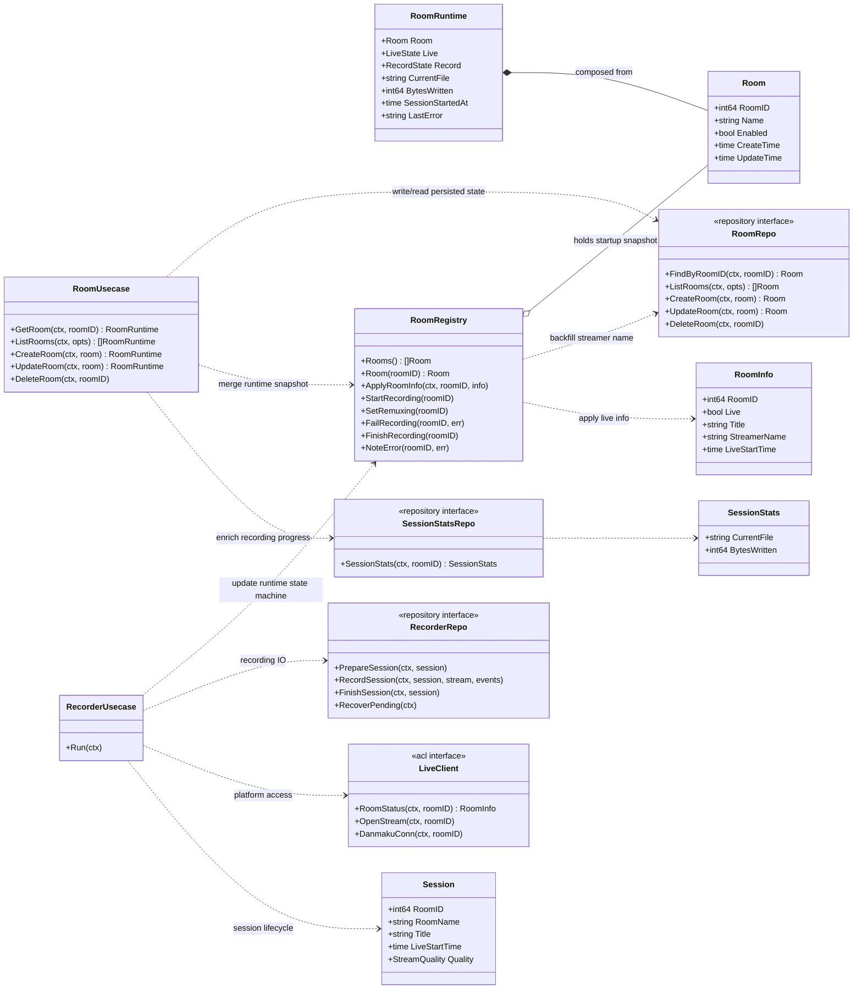

# Suika DDD 领域模型设计

本文抽离自录播技术文档，专注描述 suika 当前实现的 DDD 领域建模。

## 1. 子域划分

当前实现可抽象为两个协作子域：

- 房间管理子域（Room Management）：管理可录制房间的持久化配置与查询视图。
- 录制执行子域（Recording Execution）：负责开播感知、录制场次编排、断流重连与收尾。

## 2. 领域模型图

## 3. 建模说明

- Room 是持久化领域对象；RoomRuntime 是查询视图（读模型），由 Room 与运行时状态拼装。
- RoomRegistry 是运行时状态容器，不直接替代持久化；CRUD 仍以 RoomRepo 为准。
- RecorderUsecase 只做编排决策；平台与存储 IO 分别经 LiveClient 与 RecorderRepo 两条缝完成。
- SessionStatsRepo 是面向房间查询的窄接口，避免房间用例依赖完整录制仓储能力。
