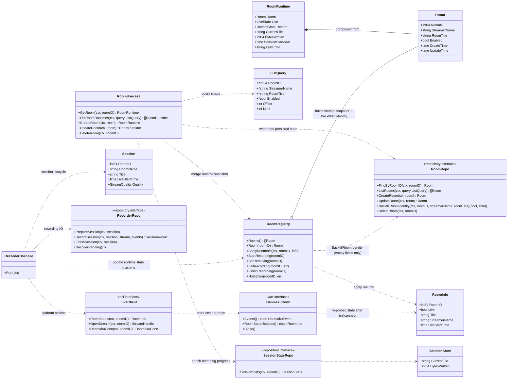

# Suika DDD 领域模型设计

本文抽离自录播技术文档（`docs/design/bili-recorder.md`），专注描述
suika 当前实现的 DDD 领域建模。类型签名与代码保持逐字对应
（`internal/biz/` 为准）。

## 1. 子域划分

当前实现可抽象为两个协作子域：

- 房间管理子域（Room Management）：管理可录制房间的持久化配置与查询
  视图。消费者是 Room CRUD API（HTTP/gRPC）与 web/ 管理界面。
- 录制执行子域（Recording Execution）：负责开播感知、录制场次编排、
  断流重连与收尾。消费者是常驻录制守护进程（server.Daemon）。

两个子域通过 `RoomRegistry`（运行时状态共享）与 `SessionStatsRepo`
（窄查询缝）协作，互不直接依赖对方的内部对象。

## 2. 领域模型图

## 3. 建模说明

- Room 是持久化领域对象，身份字段为 `StreamerName`（主播名）与
  `RoomTitle`（房间标题）——早期单一 `Name` 字段已拆分为二，两者均可
  经 CRUD 更新、也都能被平台数据条件回填。RoomRuntime 是查询视图
  （读模型），由 Room 与运行时状态拼装；持久字段永远以 repo 为准，
  registry 只贡献运行时字段。
- RoomRegistry 是运行时状态容器（每房间一份 roomState，含 Room 内存
  快照），不直接替代持久化；CRUD 仍以 RoomRepo 为准。回填走专用窄
  方法 `BackfillRoomIdentity`：SQL 条件更新只填充空列，用户经
  UpdateRoom 设置过的值不会被平台数据覆盖；repo IO 在 registry 锁外
  执行，写回失败只降级为 warn，内存快照仍然更新。
- ListQuery 是 biz 拥有的查询形状：四个 optional 等值过滤字段 +
  offset/limit。service 层把 ListRoomsRequest 的 optional 字段翻译为
  ListQuery，data 层把它翻译为 SQL；存储原语不上浮。列表没有
  order_by，repo 固定 `room_id ASC`。
- RecorderUsecase 只做编排决策；平台与存储 IO 分别经 LiveClient 与
  RecorderRepo 两条缝完成。开播感知经 DanmakuConn 的两个通道进入
  biz：`Events()`（弹幕事件，场次内直供 RecordSession）与
  `RoomStateUpdates()`（房态复查结果 `*RoomInfo`，由 data 在每次
  WS 重连后与收到房态命令时主动产生）。
- SessionStatsRepo 是面向房间查询的窄接口，由 RecorderRepo 的同一
  实例转发实现，避免房间用例依赖完整录制仓储能力。
