# Biz

`internal/biz` 是领域逻辑层（DO + usecase + repo 接口），不依赖 DTO 或存储实现。

本文档梳理三个核心模块：

| 模块 | 文件 | 职责 |
|------|------|------|
| Account | `account.go` | B 站账号扫码登录、登录态核验、登出 |
| Room / Registry | `room.go`、`room_registry.go` | 房间 CRUD（落库）+ 内存运行时注册表 |
| Recorder | `recorder*.go` | 录制守护进程：监控开播、录制、断流重连、收尾合并 |

## 0. 总览：Room 与 Recorder 如何协作

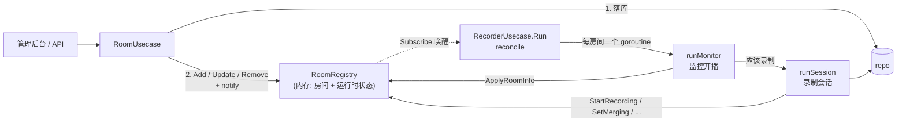

> Account 相对独立：登录凭据落库后，由 data 层热替换 `liveClient` 使用的 Cookie，无需重启录制。

---

## 1. Account 模块（`account.go`）

`CreateQRLogin` 直接调用 `client.CreateQRLogin`，返回二维码 URL / QRCodeKey / 过期时间；`Logout` 调用 `repo.DeleteCredential`（删库凭据 + 清内存登录态）。下面是两个有分支的流程。

### 1a. 轮询扫码结果 `PollQRLogin`

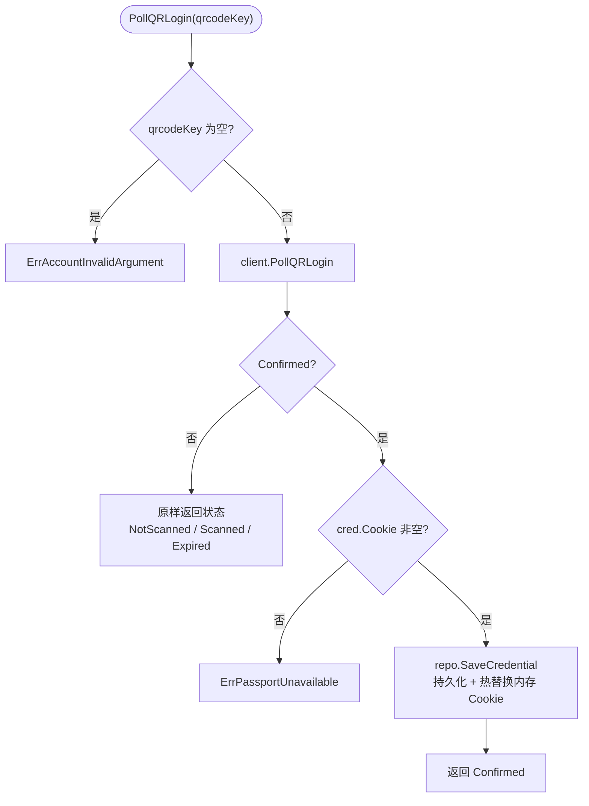

### 1b. 查询登录状态 `AccountStatus`

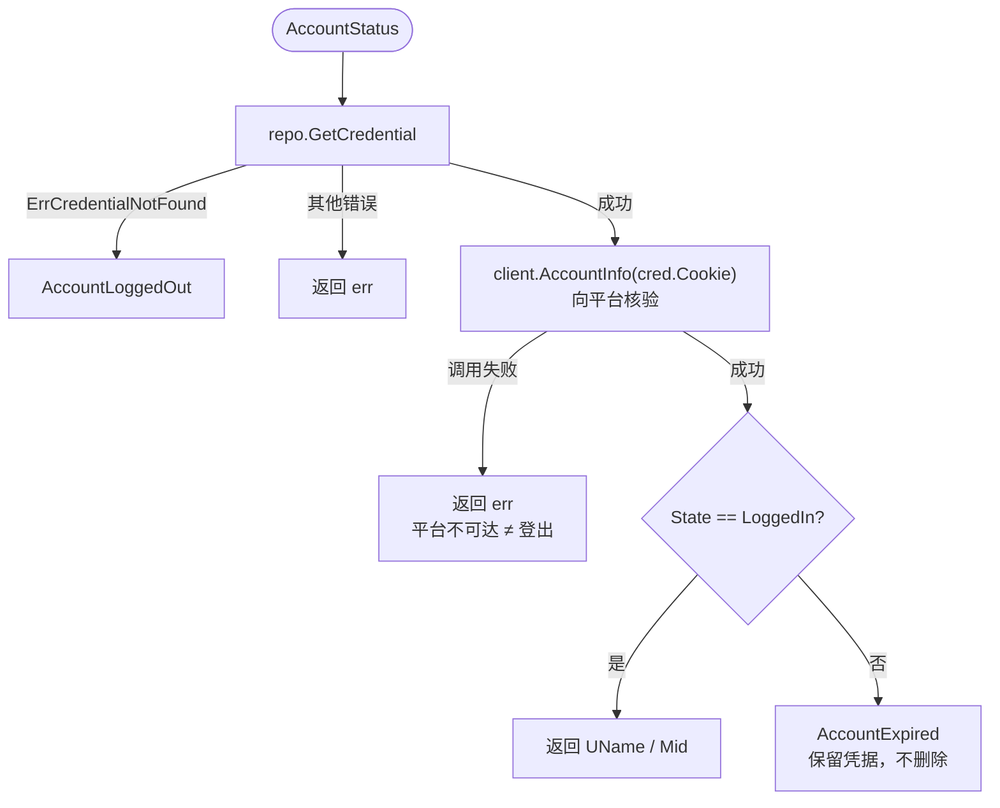

---

## 2. Room / Registry 模块（`room.go`、`room_registry.go`）

### 2a. 写路径：`CreateRoom` / `UpdateRoom` / `DeleteRoom`

三者流程一致：**校验 → 落库 → 更新内存 → 通知订阅者**。

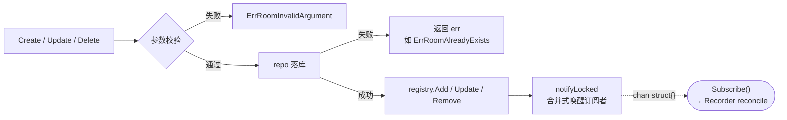

| 操作 | 校验 | registry 动作 |
|------|------|---------------|
| `CreateRoom` | `room != nil` 且 `RoomID > 0` | `Add`：登记到内存 |
| `UpdateRoom` | `room != nil` 且 `RoomID > 0` | `Update`：仅同步基础字段，**保留运行时状态** |
| `DeleteRoom` | `roomID > 0` | `Remove`：从内存移除 |

### 2b. 读路径：`GetRoom` / `ListRoomRuntimes`

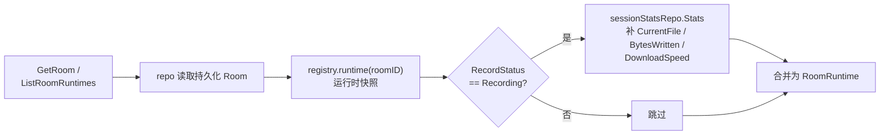

运行时快照字段：`liveStatus` / `recordStatus` / `quality` / `lastError` 等。

### 2c. Recorder 对 Registry 的运行时写入

所有写入均持锁（`setState`），并影响 2b 读到的快照。

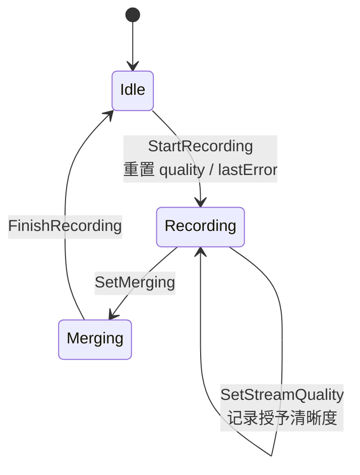

| 方法 | 作用 |
|------|------|
| `ApplyRoomInfo` | 更新 `liveStatus` / `streamer_name` / `room_title`，并异步回写 `repo.UpdateRoom` |
| `FailRecording` / `NoteError` | 记录 `lastError` |

---

## 3. Recorder 模块

文件：`recorder.go`、`recorder_monitor.go`、`recorder_session.go`、`recorder_session_policy.go`。

按 **监督循环 → 单房间监控 → 录制会话/重连 → 下播确认** 四个粒度拆成四张图（3a–3d），层层下钻：

```
Run / reconcile (3a) ──每房间──▶ runMonitor (3b) ──开播且应录制──▶ runSession (3c) ──断流时──▶ probeLive (3d)
```

### 3a. 守护主循环与调和（`Run` / `reconcile`）

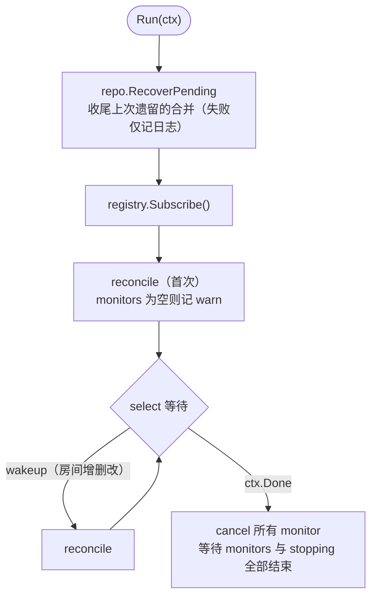

`reconcile` 让「运行中的 monitor」与「registry 当前房间集合」保持一致：

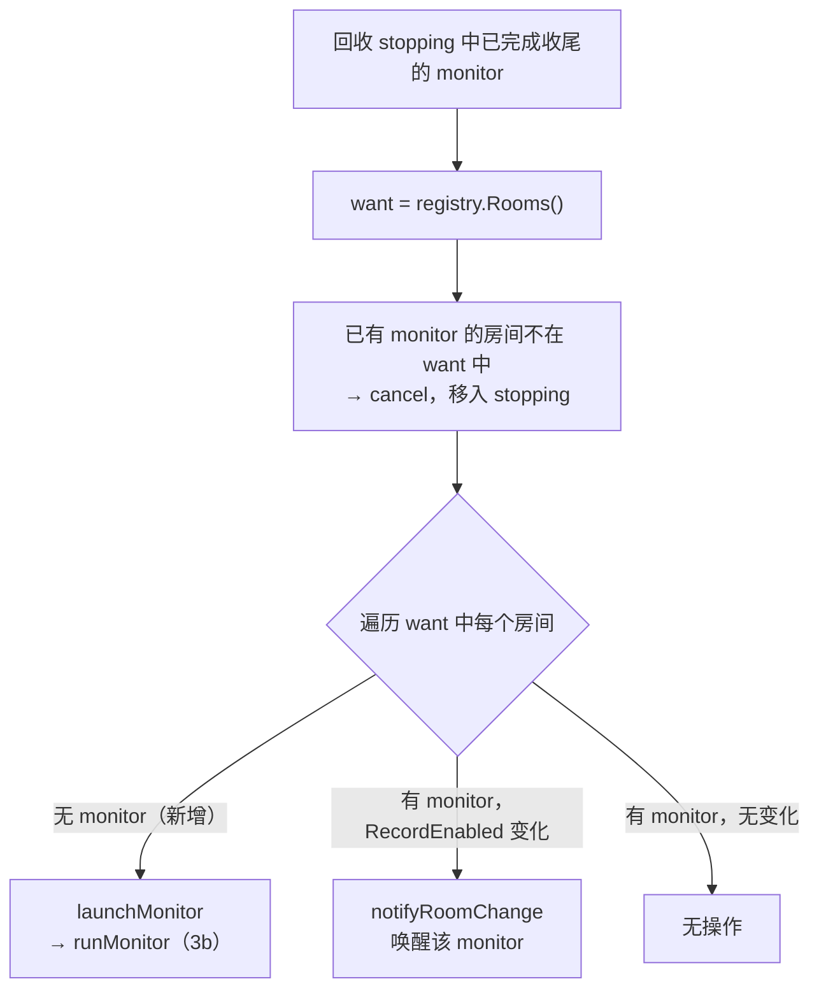

### 3b. 单房间监控与会话策略（`runMonitor` / `runMonitorConnection`）

`runMonitor` 是外层循环：连接出错或断开后，等待 `monitorReconnectDelay` 重新调用 `runMonitorConnection`。

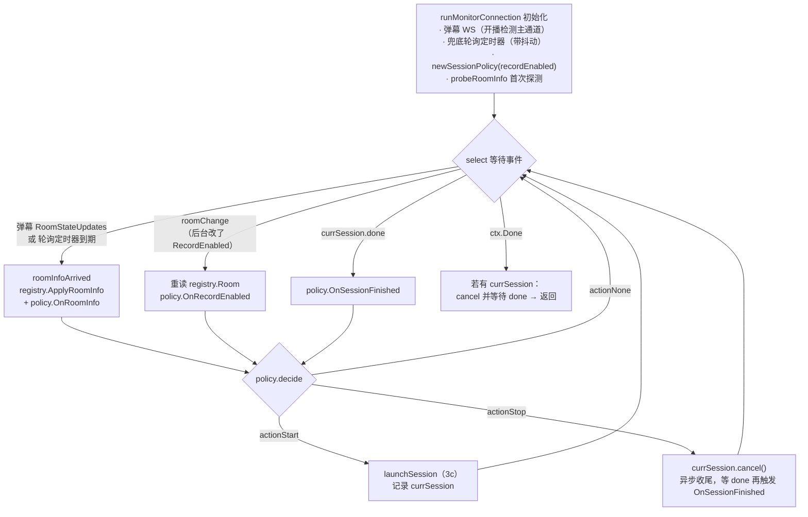

策略动作的触发条件：

| action | 条件 |
|--------|------|
| `actionStart` | 空闲（idle）且 `shouldRecord` |
| `actionStop` | 运行中（running）且 `!shouldRecord` |
| `actionNone` | 其余情况；收尾中（finishing）阶段不产生决策 |

补充：没有 `currSession` 时，弹幕事件（`Events()`）直接丢弃，仅 `RoomStateUpdates` 用于开播判定。

### 3c. 录制会话与断流重连（`runSession` / `runRecordingLoop`）

**会话生命周期**（无论录制循环如何结束，都会走完「合并收尾」）：

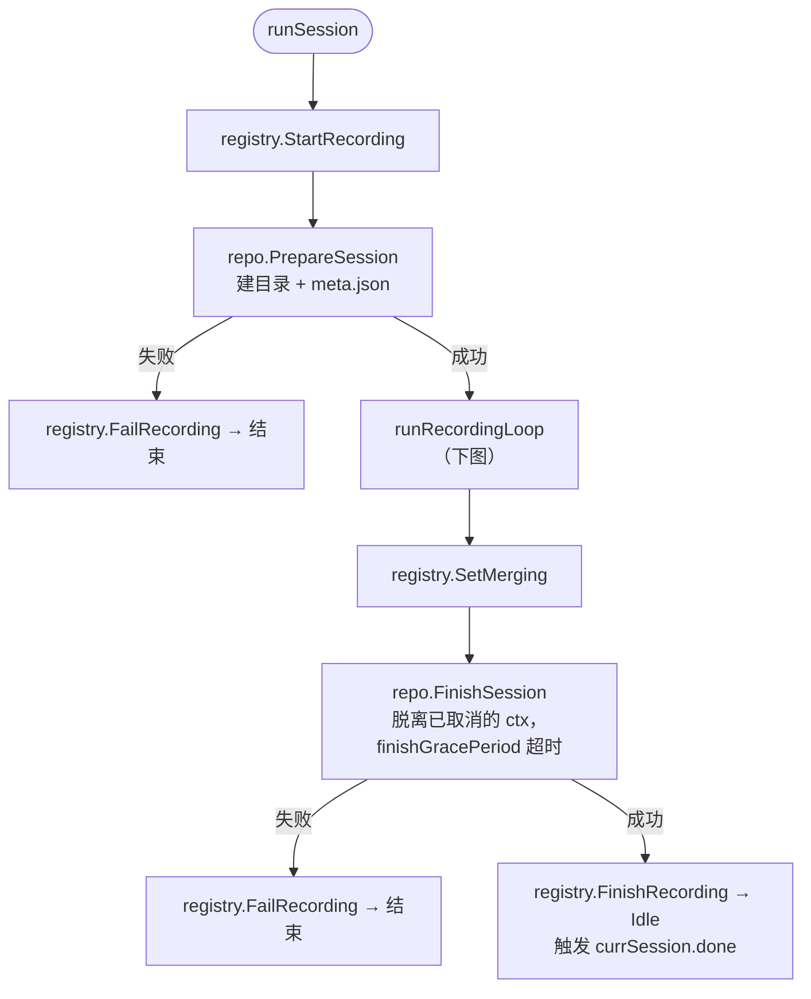

**录制循环 `runRecordingLoop`**：拉流 → 录制 → 探活 → 判定是否重连。

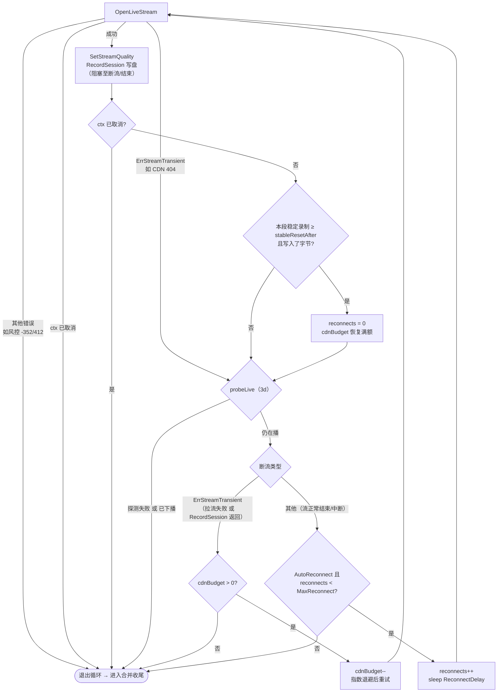

退出循环的原因（均保留已录内容，并进入合并收尾）：

| 原因 | 说明 |
|------|------|
| ctx 取消 | 上层主动停止 |
| 非 transient 的拉流错误 | 如风控 -352/412，重试无法恢复，先 `NoteError` |
| 已下播 / 探测失败 | 见 3d |
| `cdnBudget` 耗尽 | CDN 类瞬时错误重试次数用完 |
| 重连预算耗尽 / 未开启 `AutoReconnect` | 普通断流的重连次数用完或不重连 |

两类预算相互独立：`cdnBudget` 针对 CDN 瞬时错误（指数退避），`reconnects` 针对普通断流（固定延迟）；稳定录制一段时间后两者都会重置。

### 3d. 下播确认子流程（`probeLive`）

连续多次确认「不在播」才算真下播，避免短暂抖动导致误结束。

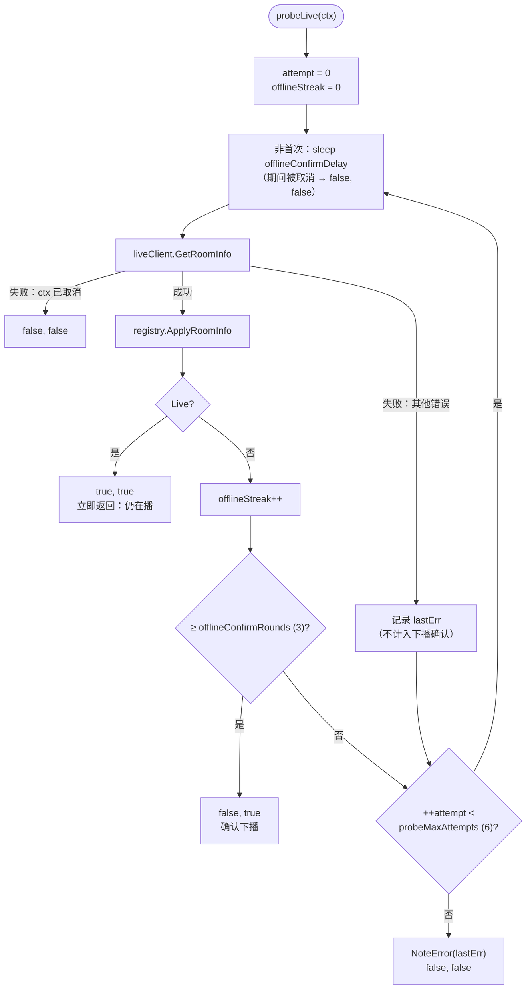

返回值 `(live, ok)` 含义：

| 返回 | 含义 | 调用方处理 |
|------|------|-----------|
| `true, true` | 仍在播 | 继续重连判定 |
| `false, true` | 确认下播 | 正常结束会话 |
| `false, false` | 无法判断（被取消 / 多次失败） | 按正常收尾结束会话 |