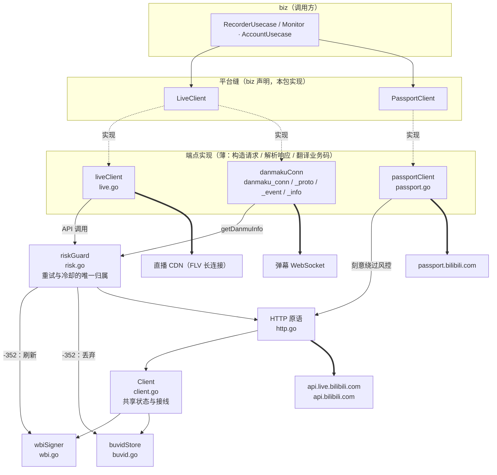

# bili

`data/bili`：与 B 站平台的**全部**交互——直播 API、弹幕 WebSocket、WBI 签名、buvid 指纹、风控编排、扫码登录。实现 `biz` 声明的两个平台缝 `biz.LiveClient` 与 `biz.PassportClient`（以及前者返回的 `biz.DanmakuConn`）。

## 架构



图里要紧的只有方向：**端点是薄的，重试/退避/冷却全部收敛到 `riskGuard` 一个模块**；`passport` 是唯一绕开它的流量。各文件的分工见下表。

## 文件

| 文件 | 内容 |
|---|---|
| `client.go` | `Client`：共享长生命周期状态——两个用途不同的 resty 客户端（API 调用 / 无超时的拉流）、唯一登录态（`Cookie` / `SetCookie` 热替换）、签名器与指纹缓存的接线 |
| `http.go` | 所有 B 站请求共用的 HTTP 原语：`browserRequest`（浏览器伪装头）、`doJSON`（状态码判定 + JSON 解码）、`fetchJSON`（把 HTTP 层风控映射为 sentinel） |
| `risk.go` | `riskGuard`：全部直播 API 调用的风控编排（见下） |
| `live.go` | `liveClient` 实现 `biz.LiveClient` 的直播侧：`GetRoomInfo` / `OpenLiveStream` / `DanmakuConn`；FLV 候选排序 `pickFLVStream`（纯函数） |
| `danmaku_conn.go` | `danmakuConn` 实现 `biz.DanmakuConn`：拨号认证、30s 心跳、90s 读超时、指数退避重连、cmd 分发 |
| `danmaku_proto.go` | 弹幕二进制包协议：16 字节包头、zlib/brotli 嵌套解压、认证包构造与握手校验 |
| `danmaku_event.go` | 消息载荷 → `biz.DanmakuEvent`：弹幕 / 礼物 / 醒目留言 / 上舰 / 进场特效 |
| `danmaku_info.go` | 弹幕认证三要素（token、接入节点、buvid3）：主通道 `getDanmuInfo`，旧版 `getConf` 兜底 |
| `wbi.go` | WBI 签名：nav 取密钥（1h 缓存）、置换表推导 mixin key、附加 `wts` / `w_rid` |
| `buvid.go` | buvid3 / buvid4 指纹：spi 获取，按 cookie 分桶缓存 24h，注入时替换同名段 |
| `passport.go` | `passportClient` 实现 `biz.PassportClient`：二维码生成/轮询、登录 Set-Cookie 拼装、nav 核验。自带 HTTP 客户端（不装 cookie jar），不依赖 `Client` |

## 风控

`riskGuard.call` 是全部直播 **API** 调用的唯一入口（直播 CDN 拉流不是 API 调用，不经此处），顺序固定：

1. **冷却闸门** —— 该房间处于冷却期则直接返回 `biz.ErrRiskControl`，不发请求；
2. **attempt** —— 端点闭包；
3. **刷新并重试一次** —— HTTP 层风控（412/403/429）或业务码 `-352` 时，刷新 WBI 密钥、丢弃缓存的 buvid，再试一次；
4. **兜底** —— 重试后仍是 `-352` 且该端点提供了 fallback（目前只有弹幕取 token 一路，走旧版 `getConf`）；
5. **记账** —— 风控类失败记入该房间递增的冷却阶梯（5 / 10 / 20 分钟）并包装为 `biz.ErrRiskControl`；`code == 0` 清除冷却。业务码非零且非风控的原样返回，由端点翻译。

## 约束

- **端点不重试、不 sleep。** 退避与冷却只属于 `riskGuard`；新增端点时不要自己写重试。
- **分层**：本包只依赖 `biz`（DO 与错误 sentinel），不 import `service` / DTO / `data` 的 PO。
- **拉流只收 FLV + `avc`**，只请求 `codec=0`；平台可降档（cookie 过期会失去原画），降档接受并记日志。见 `docs/adr/0004-avc-only-recording.md`。
- **凭据唯一来源是数据库**（QR 登录写入 `credentials` 表），不读配置；登录成功后由 `CredentialRepo` 热替换内存 cookie。

## 改哪里

| 要改的东西 | 落点 |
|---|---|
| 新增一个 B 站 API 端点 | 在对应端点文件里写 `attempt` 闭包交给 `lc.risk.call` —— 不要自己写重试 |
| 风控节奏（冷却时长、重试次数、兜底路径） | `risk.go`：`call` 与 `riskCooldownLadder` |
| 请求头、状态码判定、JSON 解码 | `http.go` |
| 清晰度档位、FLV 候选排序 | `live.go`：`sourceQualityQN`（刻意不做成配置项，见注释）、`bestFLVStream`（改前先读 ADR-0004） |
| 心跳间隔、读超时、重连退避 | `danmaku_conn.go` 顶部常量 |
| 新增一类弹幕事件 | `danmaku_event.go` 写解析函数 + 在 `danmaku_conn.go` 的 `dispatch` 里注册 cmd |
| 弹幕 token 的获取与兜底 | `danmaku_info.go` |
| WBI 签名 / buvid 指纹 | `wbi.go` / `buvid.go` |
| 扫码登录、账号核验 | `passport.go` —— 这一路刻意不走风控，不要往这里加重试 |

## 测试

```bash
go test -mod=mod ./internal/data/bili/
```

69 个用例全部离线可跑，不需要外网——`passport_test.go` 用 `httptest` 起本地回环服务，其余是纯函数：包编解码往返、zlib/brotli 嵌套解包、五类事件解析、WBI 置换表推导、签名值清洗、FLV 候选排序，以及风控的每条分支。

## 延伸阅读

- `docs/design/bili-recorder.md` —— 录制器总体设计；其中「5. 风控层（data）」是风控的完整说明，「附录 B：B 站接口速查」列了本包用到的全部端点；
- `docs/design/architecture-diagrams.md` —— 系统级时序图与状态机；
- `CONTEXT.md` —— 术语表（Room / Session / Monitor / Fallback poll / Session policy / Reconcile），写代码与注释时遵循。
