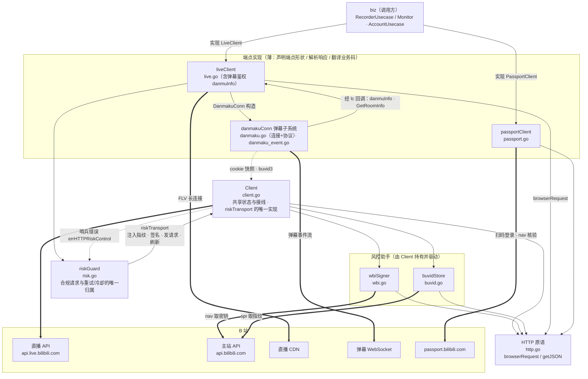

# bili

`data/bili`：与 B 站平台的**全部**交互——直播 API、弹幕 WebSocket、WBI 签名、buvid 指纹、风控编排、扫码登录。实现 `biz` 声明的两个平台缝 `biz.LiveClient` 与 `biz.PassportClient`（以及前者返回的 `biz.DanmakuConn`）。

## 架构



图里要紧的只有方向：**端点是薄的——只声明端点形状；构造合规请求（注入指纹、WBI 签名）与重试/退避/冷却全部收敛到 `riskGuard` 一个模块**。而 `riskGuard` 本身只依赖 `riskTransport` 这一个缝（生产实现是 `*Client`），既不碰 HTTP 原语、也不直接持有签名器与指纹缓存——所以"合规请求怎么构造"只有一处可改。

`liveClient` 与 `danmakuConn` 是同一颗对象树里的父子关系，不是两个独立组件：`liveClient` 构造 `danmakuConn`（`DanmakuConn` 构造），`danmakuConn` 又经持有的 `lc` 反过来调用 `liveClient` 的 `danmuInfo`（弹幕鉴权）与 `GetRoomInfo`（断线重连后的房态复查）。这是刻意的双向依赖：两者本就同属"直播侧"，没有必要为了单向箭头而拆出额外接口。

两点例外：`passport` 流量（扫码登录 / 账号核验）完全绕开风控，自带一个**不装 cookie jar** 的 resty 客户端（共用 `http.go` 的原语，但不共用 `Client` 的登录态与指纹）；直播 CDN 长连接本身不是 API 调用、不经风控——但它取址的那次 `getRoomPlayInfo` 走 `riskGuard`。

反向的一条虚线是错误契约：`errHTTPRiskControl` 定义在 `client.go`（`fetchJSON` 把 412/403/429 映射成它）、由 `risk.go` 的 `call` 消费来决定重试分支。同理 `liveAPIBase` 与 `riskCode352` 定义在 `live.go` 却由 `risk.go` 使用。各文件的分工见下表。

## 文件

| 文件 | 内容 |
|---|---|
| `client.go` | `Client`：共享长生命周期状态——两个用途不同的 resty 客户端（API 调用 / 无超时的拉流）、唯一登录态（`Cookie` / `SetCookie` 热替换）、签名器与指纹缓存的接线 |
| `http.go` | 所有 B 站请求共用的 HTTP 原语：`browserRequest`（浏览器伪装头）、`getJSON`（发送 JSON GET、状态码判定与响应解码，直播侧与 passport 侧共用） |
| `risk.go` | `riskGuard`：全部直播 API 调用的风控编排，并负责把端点声明的形状（`riskRequest`）变成合规请求（见下）。依赖的传输能力由 `riskTransport` 声明，生产实现是 `*Client` |
| `live.go` | `liveClient` 实现 `biz.LiveClient` 的直播侧：`GetRoomInfo` / `OpenLiveStream` / `DanmakuConn`；FLV 候选排序 `pickFLVStream`（纯函数）；弹幕认证三要素（token、接入节点、buvid3）的获取 `danmuInfo`/`danmuBuvid`——主通道 `getDanmuInfo` 经 WBI 签名，旧版 `getConf` 被风控时兜底，两套响应形状由 `buildDanmuInfo` 统一成形 |
| `danmaku.go` | `danmakuConn` 实现 `biz.DanmakuConn`：拨号认证、30s 心跳、90s 读超时、指数退避重连、cmd 分发；以及弹幕二进制包协议——16 字节包头、zlib/brotli 嵌套解压、认证包构造与握手校验 |
| `danmaku_event.go` | 消息载荷 → `biz.DanmakuEvent`：弹幕 / 礼物 / 醒目留言 / 上舰 / 进场特效 |
| `wbi.go` | WBI 签名：nav 取密钥（1h 缓存）、置换表推导 mixin key、附加 `wts` / `w_rid` |
| `buvid.go` | buvid3 / buvid4 指纹：spi 获取，按 cookie 分桶缓存 24h，注入时替换同名段 |
| `passport.go` | `passportClient` 实现 `biz.PassportClient`：二维码生成/轮询、登录 Set-Cookie 拼装、nav 核验。自带 HTTP 客户端（不装 cookie jar），不依赖 `Client` |

## 风控

`riskGuard.call` 是全部直播 **API** 调用的唯一入口（直播 CDN 拉流不是 API 调用，不经此处），顺序固定：

1. **冷却闸门** —— 该房间处于冷却期则直接返回 `biz.ErrRiskControl`，不发请求；
2. **attempt** —— 端点声明的一次调用（见下）；
3. **刷新并重试一次** —— HTTP 层风控（412/403/429）或业务码 `-352` 时，刷新 WBI 密钥、丢弃缓存的 buvid，再试一次；
4. **兜底** —— 重试后仍是 `-352` 且该端点提供了 fallback（目前只有弹幕取 token 一路，走旧版 `getConf`）；
5. **记账** —— 风控类失败记入该房间递增的冷却阶梯（5 / 10 / 20 分钟）并包装为 `biz.ErrRiskControl`；`code == 0` 清除冷却。业务码非零且非风控的原样返回，由端点翻译。

**端点只声明形状，不构造请求。** `riskRequest` 描述路径、查询参数、是否需要 WBI 签名、响应落点，以及一个可选的 `done` 钩子（业务码为 0 后把响应转成领域对象或做额外校验）。`riskGuard.fetch` 负责拼上 `liveAPIBase`、编码查询参数、按 `sign` 决定签名、注入新鲜 buvid 指纹，最后读 `codedResponse.bizCode()` 判码。这样"忘了注入指纹""忘了签名"在结构上不可能发生——旧接口的"有意不签名"也变成显式的 `sign: false`，而不是一个只能靠注释辨认的省略。

## 约束

- **端点不重试、不 sleep、不自己构造请求。** 退避、冷却与合规请求（指纹、签名）只属于 `riskGuard`；新增端点时只声明 `riskRequest`。
- **分层**：本包只依赖 `biz`（DO 与错误 sentinel），不 import `service` / DTO / `data` 的 PO。
- **拉流只收 FLV + `avc`**，只请求 `codec=0`；平台可降档（cookie 过期会失去原画），降档接受并记日志。见 `docs/adr/0004-avc-only-recording.md`。
- **凭据唯一来源是数据库**（QR 登录写入 `credentials` 表），不读配置；登录成功后由 `CredentialRepo` 热替换内存 cookie。

## 改哪里

| 要改的东西 | 落点 |
|---|---|
| 新增一个 B 站 API 端点 | 在对应端点文件里声明 `riskRequest`（path / query / sign / out / done）交给 `lc.risk.call` —— 不要自己构造请求、写重试 |
| 风控节奏（冷却时长、重试次数、兜底路径） | `risk.go`：`call` 与 `riskCooldownLadder`；整体调用的兜底端点用 `riskCall.fallback` |
| 合规请求的构造（拼路径、编码参数、签名、注入指纹） | `risk.go`：`fetch` |
| 请求头、状态码判定、JSON 解码 | `http.go` |
| 清晰度档位、FLV 候选排序 | `live.go`：`sourceQualityQN`（刻意不做成配置项，见注释）、`bestFLVStream`（改前先读 ADR-0004） |
| 心跳间隔、读超时、重连退避 | `danmaku.go` 顶部常量 |
| 新增一类弹幕事件 | `danmaku_event.go` 写解析函数 + 在 `danmaku.go` 的 `dispatch` 里注册 cmd |
| 弹幕 token 的获取与兜底 | `live.go`：`danmuInfo` |
| WBI 签名 / buvid 指纹 | `wbi.go` / `buvid.go` |
| 扫码登录、账号核验 | `passport.go` —— 这一路刻意不走风控，不要往这里加重试 |

## 测试

```bash
go test -mod=mod ./internal/data/bili/
```

73 个用例全部离线可跑，不需要外网——`passport_test.go` 用 `httptest` 起本地回环服务，其余是纯函数或假实现：包编解码往返、zlib/brotli 嵌套解包、五类事件解析、WBI 置换表推导、签名值清洗、FLV 候选排序，以及风控的每条分支。风控测试用一个假 `riskTransport`（`scriptedTransport`）替代真实的 HTTP 客户端，因此连**请求构造**本身也被断言：路径与查询参数的编码、`sign` 开关是否生效、注入的指纹快照、`done` 钩子的时机。

## 延伸阅读

- `docs/design/bili-recorder.md` —— 录制器总体设计；其中「5. 风控层（data）」是风控的完整说明，「附录 B：B 站接口速查」列了本包用到的全部端点；
- `docs/design/architecture-diagrams.md` —— 系统级时序图与状态机；
- `CONTEXT.md` —— 术语表（Room / Session / Monitor / Fallback poll / Session policy / Reconcile），写代码与注释时遵循。
